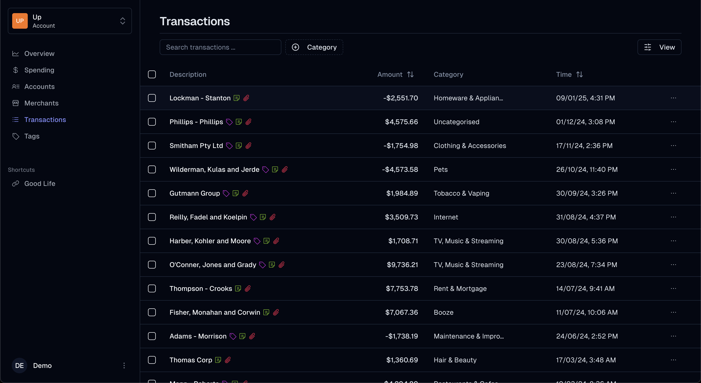
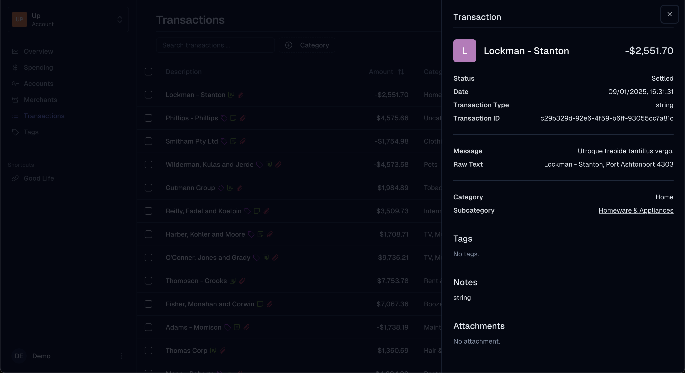

<h1>Up Board</h1>

Personalised insights and data visualisation for your Up account.

## Usage

### Generating mock data

1. Install [tsx](https://www.npmjs.com/package/tsx) as a global dependency
2. Add `type: "module"` to `package.json` locally
3. Run `tsx scripts/generateMockData.ts` to generate mock account and transaction data

Categories data is obtained from `https://api.up.com.au/api/v1/categories` endpoint.

## Notes

To read more about Up's API, please go to https://developer.up.com.au/.

This application is built with:

- Next.js (this repository)
  - Tailwind + [shadcn/ui](https://ui.shadcn.com/) + [tremor](https://www.tremor.so/)
- MongoDB
  - Stores transactions, accounts, categories
- AWS Lambda
  - Consumes Up webhook event to sync new, deleted or settled transactions
  - Periodically syncs changes to transaction categories and tags

## Screenshots

### Homepage

### Transaction account

### Saver account

### Transactions

### Transaction details

